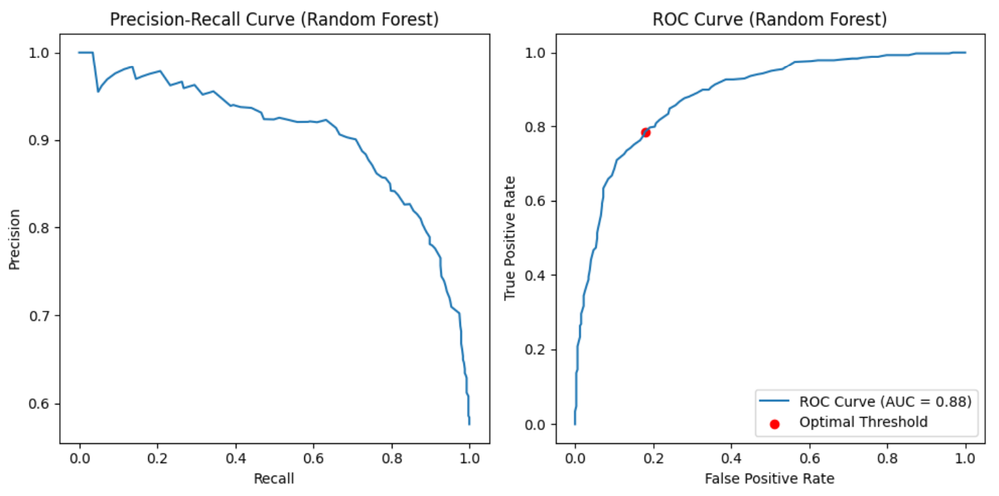

# Machine Learning Classification Metrics

## Overview
This project explores various quality metrics for binary classification models. It evaluates the performance of different classifiers using precision, recall, F1-score, log loss, and ROC-AUC. The dataset used is `bioresponse.csv`, with `Activity` as the target variable.

## Dataset
The dataset contains biological response data and is processed as follows:
```python
x_data, y_data = DataProcessor.parse_csv_by_attribute("data/bioresponse.csv", "Activity")
x_train_data, x_test_data, y_train_data, y_test_data = DataProcessor.split_by_train_and_test_data(x_data, y_data)
```

## Classifiers
We train and evaluate four classifiers:
- **Decision Tree**
- **Random Forest**
- **Deep Decision Tree** (max depth = 10)
- **Deep Random Forest** (max depth = 10)

```python
dt_classifier_model = ClassifierModel(DecisionTreeClassifier(), "Decision Tree")
rf_classifier_model = ClassifierModel(RandomForestClassifier(), "Random Forest")
dt_classifier_deep_model = ClassifierModel(DecisionTreeClassifier(max_depth=10), "Deep Decision Tree")
rf_classifier_deep_model = ClassifierModel(RandomForestClassifier(max_depth=10), "Deep Random Forest")

models = [dt_classifier_model, rf_classifier_model, dt_classifier_deep_model, rf_classifier_deep_model]

for classifier_model in models:
    classifier_model.classifier.fit(x_train_data, y_train_data)
```

## Performance Metrics
The following metrics are calculated for each model:
- **Accuracy**
- **Precision**
- **Recall**
- **F1 Score**
- **Log Loss**

```python
for classifier_model in models:
    ClassifierProcessor.evaluate_classifier(classifier_model, x_test_data, y_test_data)
```

### Results
| Model                  | Accuracy | Precision | Recall | F1 Score | Log Loss | AUC   |
|------------------------|----------|----------|--------|----------|----------|-------|
| Decision Tree         | 0.6858   | 0.7362   | 0.7090 | 0.7224   | 11.3266  | 0.6815 |
| Random Forest        | 0.8029   | 0.8369   | 0.8176 | 0.8271   | 7.1031   | 0.8826 |
| Deep Decision Tree   | 0.7270   | 0.7627   | 0.7644 | 0.7636   | 9.8388   | 0.6861 |
| Deep Random Forest  | 0.7923   | 0.8305   | 0.8037 | 0.8169   | 7.4871   | 0.8648 |

## Precision-Recall and ROC Curves
```python
for classifier_model in models:
    ClassifierProcessor.calculate_precisions_recalls_and_roc_curves_and_optimal_threshold(classifier_model, x_test_data, y_test_data)
    ClassifierMetricsVisualizer.plot_precisions_recalls_and_roc_curves(classifier_model)
```

**Precision-Recall and ROC Curves:**





## Avoiding Type II Errors
A separate classifier is trained to minimize Type II errors (false negatives):
```python
avoid_type_ii_error_rf_classifier_model = ClassifierModel(RandomForestClassifier(), "Avoid Type II Error Random Forest")
avoid_type_ii_error_rf_classifier_model.classifier.fit(x_train_data, y_train_data)

ClassifierProcessor.calculate_precisions_recalls_and_roc_curves_and_optimal_threshold(avoid_type_ii_error_rf_classifier_model, x_test_data, y_test_data)
ClassifierMetricsVisualizer.plot_precisions_recalls_and_roc_curves(avoid_type_ii_error_rf_classifier_model)
ClassifierProcessor.evaluate_classifier(avoid_type_ii_error_rf_classifier_model, x_test_data, y_test_data, True)
```

**ROC Curve for Type II Error Reduction:**


### Results
| Model                                   | Accuracy | Precision | Recall | F1 Score | Log Loss | AUC   |
|-----------------------------------------|----------|----------|--------|----------|----------|-------|
| Avoid Type II Error Random Forest      | 0.8056   | 0.8225   | 0.8453 | 0.8337   | 7.0072   | 0.8797 |

## Conclusion
- The **Random Forest** classifier showed the highest AUC value (0.8826), indicating strong classification performance.
- Adjusting the **decision threshold** helped optimize recall to reduce Type II errors.
- The **Avoid Type II Error Random Forest** classifier achieved the best recall score, making it preferable in cases where false negatives are costly.

This project demonstrates effective tuning of classification models to improve their predictive power and optimize trade-offs between precision and recall.
